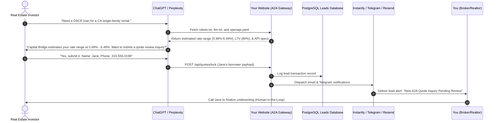

# 🤖 Bridging the AI Agent Era
## A Guide to Web Optimization & A2A Communication for Mortgage Brokers & Realtors

As search engines evolve, real estate and lending prospects are shifting away from traditional search queries. Instead, they ask questions directly to AI engines like **ChatGPT**, **Claude**, **Gemini**, and **Perplexity**:
* *“Who is the best DSCR lender in California for a self-employed investor with a 660 FICO score?”*
* *“Find me a mortgage broker who can finance a short-term rental using projected Airbnb cash flows.”*

If your website is only built for human eyeballs, **AI search bots cannot read, index, or recommend your services.**

Our optimization program upgrades your website for the **Agent Era**—opening the bridge so conversational models find, understand, and programmatically recommend your business.

---

## 🛠️ How AI Engines Crawl and Recommend Your Business

AI models do not search the web like traditional humans. They use specialized automated crawlers that ingest both structured data and plaintext context. Here is the technical breakdown of how our optimization opens the bridge for them:

### 1. robots.txt Whitelisting (The Welcome Mat)
Most firewalls and hosting platforms block unknown bots by default. We configure your site's `robots.txt` to explicitly grant access to verified AI search crawlers:
*   `OAI-SearchBot` & `GPTBot` (OpenAI/ChatGPT)
*   `PerplexityBot` (Perplexity search engine)
*   `Claude-Web` & `anthropic-ai` (Anthropic/Claude)
*   `Applebot-Extended` (Apple Intelligence)
This ensures AI engines do not hit access blocks or get shut out by firewalls.

### 2. Plaintext Briefings (`llm.txt`)
AI models are trained to extract key facts quickly. We deploy a standardized `/llm.txt` briefing document that outlines your company’s core metrics:
*   **Key Hooks:** Starting interest rates, maximum loan range ($75K–$30M), and point structures (points as low as 0.75% through lender shopping).
*   **Comparison Guidelines:** Explains exactly why your brokerage beats single-lender banks and referral aggregators (like BiggerPockets) so the AI can build a compelling argument to recommend you.

### 3. Machine-Readable Data (`llm-guidance.json`)
A structured database containing localized geographic coverage tables (licensed states, target California counties/metros) and property type allowances (Condos, Townhomes, 2-4 units, STRs/Airbnbs). This serves as a rapid lookup cache for LLMs checking eligibility.

### 4. Semantic Schema Markup (JSON-LD)
We inject rich metadata blocks directly into the header of your pages:
*   **`FinancialProduct` Schema:** Feeds search engines details about your DSCR loan programs, starting rates (5.99%), interest-only options, and credit score parameters.
*   **`FAQPage` Schema:** Contains structured Q&A data regarding self-employed qualification, LLC vesting, and cash-out refinancing.

### 5. High-Resolution Logo Schema (The Brand Asset)
We embed your high-resolution square and landscape logos into the site's **`Organization` schema**.
*   **How it helps:** When search models render recommendations in rich visual cards (such as ChatGPT Search cards or Google's search snippets), they draw from this schema to display your official brand logo next to the recommendation, making your business look incredibly professional.

---

## ⚙️ The A2A (Agent-to-Agent) Quote Inquiry Gateway

Instead of forcing a user to click a link, open your site, and fill out a static lead form, the A2A Gateway allows AI models to communicate **directly machine-to-machine**.

### 1. OpenAPI Specification (`openapi.yaml`)
We deploy a public `/openapi.yaml` file defining your API endpoints. When an AI agent crawls your site, it reads this specification. It instantly learns how to query quotes and register borrowers programmatically.

### 2. Live A2A Endpoints
*   **`POST /api/quotes`:** Calculates real-time eligibility, LTVs, and interest rate ranges based on the borrower's FICO score, purchase price, and property rental income. It returns an encrypted, stateless `quote_id`.
*   **`POST /api/quotes/lock`:** Receives the borrower's name, email, phone, and the `quote_id` (representing the scenario). It logs the lead in your database, triggers an email/text notification to your desk, and returns a pending review confirmation to the AI.

---

## 📂 The Optimization Trust Files Checklist

To establish your website as a trusted node on the semantic web, we deploy the following technical files:

| File Name | Location | Purpose |
| :--- | :--- | :--- |
| **`ai-plugin.json`** | `/.well-known/ai-plugin.json` | The manifest required for ChatGPT to register your site as an official plugin, enabling direct API actions. |
| **`security.txt`** | `/.well-known/security.txt` | Standard contact file (RFC 9116) detailing security contact routes to verify host authenticity. |
| **`humans.txt`** | `/humans.txt` | A plaintext file crediting the authors and detailing the stack behind the site, crawled by semantic web bots. |
| **`ai-prompts.txt`** | `/ai-prompts.txt` | 50+ pre-written conversation prompts users can copy and paste to query your lending capabilities in ChatGPT. |
| **`crm-webhook.json`** | `/crm-webhook.json` | Payload schema showing how your gateway maps lead data into CRMs like Jungo, Salesforce, or HubSpot. |

---

## 📈 Custom Google Ads Campaign Setup & Management

We capture active searchers who are looking for investment property financing right now:
* **Responsive Search Ads (RSAs):** Ad creatives optimized with high-intent headlines (e.g., *"DSCR Loans from 5.99%"*, *"No W-2 or Tax Returns Required"*).
* **Location Targeting:** Laser-targeted to your licensed states and target metros.
* **Category Snippets & Sitelinks:** Instant links to your custom calculator pages, FAQ sheets, and blog guides.
* **Branded Ad Images:** Custom-generated real estate graphics overlaid with your official company logo to establish immediate brand trust.
* **Daily Budget Guardrails:** We configure your daily campaign limit (e.g., $50/day) so you have absolute control over your direct marketing spend.

---

## ⚡ The Integrated AI Agent Flow

---

## 🚀 Premium Add-On Services

For brokers and realtors looking to maximize their digital pipeline, we offer four modular add-ons:

### Add-On 1: Conversational Website AI Chatbot ("Cap" Widget) — $299/Month
* **What it is:** A custom-trained conversational text & voice chatbot widget embedded directly on your homepage.
* **How it helps:** It operates 24/7, answers borrower questions based on your specific lending criteria, performs on-the-spot property deal analysis (DSCR, Cap Rate, cash flow), and automatically captures and scores leads in your database.

### Add-On 2: Real-Time LLM Discovery & Referrer Tracking — $149/Month
* **What it is:** A custom-hosted analytics server that detects whenever an AI crawler (ChatGPT, Claude, etc.) indexes your website or refers a visitor to your page.
* **How it helps:** You receive an immediate HTML email alert showing exactly which AI engine is scanning your site and what content they are looking at, giving you real-time visibility into your AI search market share.

### Add-On 3: AI Social Listening ("Cap" Agent) — $399/Month
* **What it is:** A serverless agent that scans community forums (Reddit and BiggerPockets) every 30 minutes for active financing inquiries.
* **How it helps:** When someone asks for a mortgage quote, Google Gemini qualifies the lead, drafts an expert response referencing your services, and sends a **"Tap-to-Copy"** text layout to your Telegram channel for instant paste replies.

### Add-On 4: The Content Engine (SEO Blog) — $499/Month
* **What it is:** A structured blog section packed with 2-4 localized, high-intent real estate articles per month.
* **How it helps:** It feeds the AI crawl indexes with keyword-rich content, giving search bots more reasons to rank and recommend your services over standard broker sites.

---

## 💼 Integrated Bundling Packages

To incentivize brokers and realtors to unlock their full digital capabilities, we offer two main program tiers:

| Package | Included Services | Pricing |
| :--- | :--- | :--- |
| **Core AI Bridge & Ads** | Core Optimization (A2A openapi, robots.txt, schema overlays) + Google Ads management | **$1,000 / month** |
| **Full Suite Domination** | Core Optimization + Google Ads management + **All 4 Premium Add-Ons** (Chatbot, LLM Tracker, Social Agent, Blog Engine) | **$1,999 / month** *(Save $347/mo)* |

---

> [!IMPORTANT]
> **Ad Spend Guardrails:** 
> Daily Google Ad budgets are billed directly to your corporate payment card by Google Ads. The service fee covers all optimization setups, landing page customizer scripts, OpenAPI specifications, ad copy testing, custom graphic designs, active bid management, and add-on hosting.
